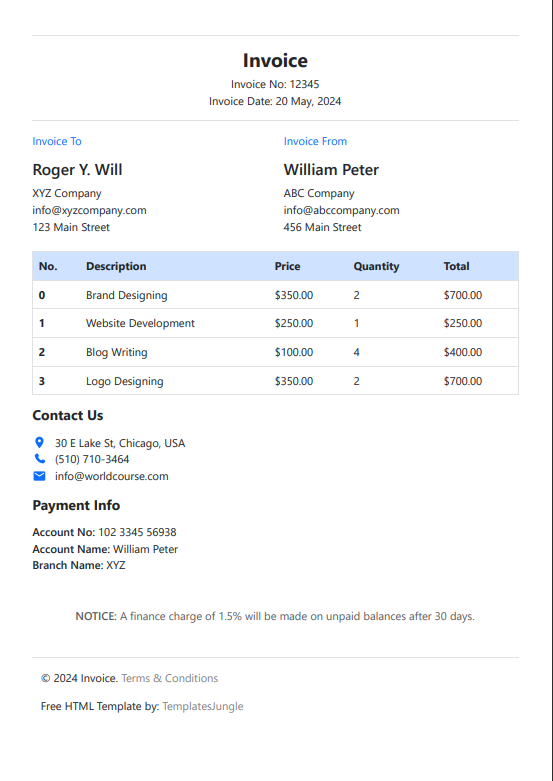

# PDFile

PDFile is a Node.js library for generating high-quality, dynamic PDFs using Handlebars templates and Puppeteer. It supports multi-page PDFs and offers full customization. Perfect for web developers, it enables easy creation of multi-page PDFs by simply designing HTML templates for output.

## Installation

```sh
npm i pdfile
```

## Usage

### Initialization

Import the function

```javascript
import { generatePdf } from 'pdfile';
```

Call the function to generate the PDF

```javascript
const generatedPdfFilePath = await generatePdf({
  [templateFilePath],
  [dataPerPage],
  [pdfFilePath],
  [useStream],
  [helpersFilePath],
  [puppeteerOptions],
  [pdfOptions],
});
```


| Parameter      | Type           | Description                  |Required                  | Default                  |
| --------------- | ---------------------- | ----------------------------- | ---------------------- | ----------------------------- |
| `templateFilePath`  | `string`     | Path to the Handlebars template file. | `Yes`     | `N/A` |
| `dataPerPage`  | `Array` | Array of objects containing data for each page of the PDF | `Yes`     | `N/A` |
| `pdfFilePath`   | `string`    | The path where the generated PDF file will be saved. Required, if **useStream** is not passed or set to false. | `No`     | `N/A` |
| `useStream`    | `boolean`     | Returns a readable stream of the PDF instead of saving it to disk if set to true | `No`     | `false` |
| `helpersFilePath`   | `string`    | Path to a file containing custom Handlebars helpers. | `No`     | `N/A` |
| `puppeteerOptions`    | `object`     | Puppeteer launch options (e.g., headless mode, executable path). <[PuppeteerLaunchOptions](https://pptr.dev/api/puppeteer.puppeteerlaunchoptions 'PuppeteerLaunchOptions')> | `No`     |  <pre lang="json"> { "headless": true, "args": ["--no-sandbox", "--disable-setuid-sandbox", "--disable-dev-shm-usage"] } </pre>    |
| `pdfOptions`   | `object`    | Options for PDF generation (e.g., format, margins). <[PDFOptions](https://pptr.dev/api/puppeteer.pdfoptions 'PDFOptions')> | `No`     | <pre lang="json"> { "format": "A4", "margin": { "left": "10mm", "top": "10mm", "right": "10mm", "bottom": "10mm" }, "printBackground": true } </pre> |


### Working Example

To quickly get started, you can use the 'example' folder and check out the working code given in the file 'file.service.ts'. Ensure all dependencies are installed beforehand.

PDF generated in this example:



### More details

---

| JavaScript      | Handlebars Helper Syntax (Standard)           | Handlebars Helper Syntax (Custom)                  |
| --------------- | ---------------------- | ----------------------------- |
| `if (a === b)`  | `{{#if (eq a b)}}`     | `{{#ifCond var1 '===' var2}}` |
| `if (a !== b)`  | `{{#if (not-eq a b)}}` | `{{#ifCond var1 '!==' var2}}` |
| `if (a && b)`   | `{{#if (and a b)}}`    | `{{#ifCond var1 '&&' var2}}`  |
| `if (a > b)`    | `{{#if (gt a b)}}`     | `{{#ifCond var1 '>' var2}}`   |
| `if (a >= b)`   | `{{#if (gte a b)}}`    | `{{#ifCond var1 '>=' var2}}`  |
| `if (a < b)`    | `{{#if (lt a b)}}`     | `{{#ifCond var1 '<' var2}}`   |
| `if (a <= b)`   | `{{#if (lte a b)}}`    | `{{#ifCond var1 '<=' var2}}`  |
| `if (a && b)`   | `{{#if (and a b)}}`    | `{{#ifCond var1 '&&' var2}}`  |
| `if (a \|\| b)` | `{{#if (or a b)}}`     | `{{#ifCond var1 \|\| var2}}`  |

## License

[MIT](LICENSE)
