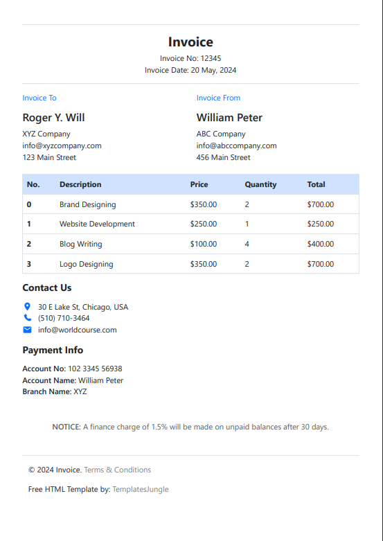

# PDFile

PDFile is a lightweight Node.js library for generating high-quality, dynamic PDFs from Handlebars templates using Puppeteer. It supports multi-page PDFs, true streaming output, and a caller-owned browser lifecycle suitable for servers and long-running processes.

## Installation

```sh
npm i pdfile
```

> Requires Node.js 18+. Puppeteer downloads a matching Chromium on install.

## Quick start

```ts
import { generatePdf, closeBrowser } from 'pdfile';

await generatePdf({
  templateFilePath: 'templates/invoice.hbs',
  dataPerPage: [{ invoiceNumber: 1, total: '$100' }],
  pdfFilePath: 'out/invoice.pdf',
});

// Always release Chromium when you're done with the singleton API.
await closeBrowser();
```

## API

### `generatePdf(options)` — singleton

Uses a module-level Browser. Convenient for scripts and one-shot use. Call `closeBrowser()` when finished so the Node process can exit.

| Option              | Type                            | Required             | Default                                            | Description                                                                              |
| ------------------- | ------------------------------- | -------------------- | -------------------------------------------------- | ---------------------------------------------------------------------------------------- |
| `templateFilePath`  | `string`                        | Yes                  | —                                                  | Path to the Handlebars template file.                                                    |
| `dataPerPage`       | `Array<object>`                 | Yes                  | —                                                  | One object per page. Each entry renders the template once; outputs are concatenated.     |
| `pdfFilePath`       | `string`                        | If `useStream` false | —                                                  | Where to write the generated PDF.                                                        |
| `useStream`         | `boolean`                       | No                   | `false`                                            | Return a Readable PDF stream instead of writing to disk. Mutually exclusive with `pdfFilePath`. |
| `helpers`           | `Record<string, Function>`      | No                   | —                                                  | Custom Handlebars helpers as a plain object. **Preferred** over `helpersFilePath`.       |
| `helpersFilePath`   | `string`                        | No                   | —                                                  | _Deprecated._ Path to a JSON file of stringified function bodies; loaded via `new Function`. |
| `puppeteerOptions`  | [`LaunchOptions`](https://pptr.dev/api/puppeteer.puppeteerlaunchoptions) | No | `{ headless: true, args: ['--no-sandbox', '--disable-setuid-sandbox', '--disable-dev-shm-usage'] }` | Puppeteer launch options (only honored on the first call for the singleton). |
| `pdfOptions`        | [`PDFOptions`](https://pptr.dev/api/puppeteer.pdfoptions) | No | A4, 10mm margins, `printBackground: true`                                  | Merged on top of the defaults.                                                           |

### `PdfGenerator` — caller-owned lifecycle

Each instance owns its own Browser. Use this in servers, tests, or any context where you don't want a global. Multiple instances can run in parallel.

```ts
import { PdfGenerator } from 'pdfile';

const gen = new PdfGenerator({ headless: 'new' });
try {
  await gen.generate({
    templateFilePath: 'templates/invoice.hbs',
    dataPerPage: [data],
    pdfFilePath: 'out/invoice.pdf',
  });
} finally {
  await gen.close();
}
```

- `new PdfGenerator(launchOptions?)` — Puppeteer launch options.
- `warmup()` — pre-launch Chromium (optional).
- `generate(options)` — same option shape as `generatePdf` (without `puppeteerOptions`).
- `close()` — shut down the owned Browser.

### Streaming output

When `useStream: true`, `generate()` returns a Puppeteer-native PDF `Readable` (via `page.createPDFStream()`) — the PDF is not buffered into memory.

```ts
import { createWriteStream } from 'fs';
import { pipeline } from 'stream/promises';

const stream = await generatePdf({
  templateFilePath: 'templates/invoice.hbs',
  dataPerPage: [data],
  useStream: true,
});

await pipeline(stream, createWriteStream('out/invoice.pdf'));
```

### Custom helpers

Prefer the object form — safe, type-checked, and visible to your bundler:

```ts
await gen.generate({
  templateFilePath,
  dataPerPage,
  pdfFilePath,
  helpers: {
    money: (n: number) => `$${n.toFixed(2)}`,
    upper: (s: string) => s.toUpperCase(),
  },
});
```

The legacy `helpersFilePath` JSON format (`{ "name": "function(a){ return a; }" }`) is still accepted but **deprecated** — values are passed through `new Function`, so anyone who can write to that file can run code in your process.

### Multi-page templates

Each entry in `dataPerPage` renders the template once and the outputs are concatenated. For paginated output, include a page break at the bottom of your template:

```hbs
<section style="page-break-after: always">
  <!-- one page of content -->
</section>
```

### Built-in Handlebars helpers

| JavaScript      | Standard helper        | `ifCond` block helper           |
| --------------- | ---------------------- | ------------------------------- |
| `a === b`       | `{{#if (eq a b)}}`     | `{{#ifCond a '===' b}}`         |
| `a !== b`       | `{{#if (ne a b)}}`     | `{{#ifCond a '!==' b}}`         |
| `a > b`         | `{{#if (gt a b)}}`     | `{{#ifCond a '>' b}}`           |
| `a >= b`        | `{{#if (gte a b)}}`    | `{{#ifCond a '>=' b}}`          |
| `a < b`         | `{{#if (lt a b)}}`     | `{{#ifCond a '<' b}}`           |
| `a <= b`        | `{{#if (lte a b)}}`    | `{{#ifCond a '<=' b}}`          |
| `a && b`        | `{{#if (and a b)}}`    | `{{#ifCond a '&&' b}}`          |
| `a \|\| b`      | `{{#if (or a b)}}`     | `{{#ifCond a '\|\|' b}}`        |

### Working example

See [`example/file.service.ts`](./example/file.service.ts) for a runnable invoice example. The generated PDF:



## License

[MIT](LICENSE)
